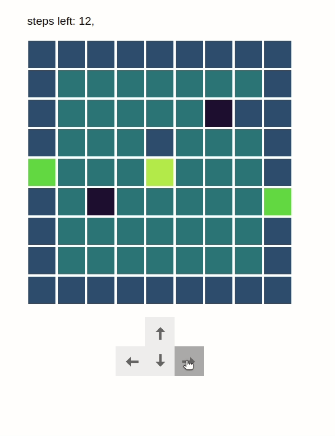

# WC1 - game of DOM

Zorg ervoor dat het spel werkt. De instructies staan inline bij de code.
In volgorde:

1. render het spelbord, vul elke tegel in met de kleur zoals die in het object gedefinieerd staat
   1. de kleur van de tegel wordt bepaald door de type attribuut van die tegel
   1. tegels zonder een type worden automatisch "ground" tegels
1. Zorg ervoor dat je elke render de tegels leeg maakt en het character element toevoegd op de juiste positie
   1. Je kan de juiste tegels selecteren aan de hand van de col en row van het player object
   1. je bouwt het character element dynamisch op by elke render
1. zorg dat het aantal overblijvende stappen accuraat wordt bijgehouden en geef dit weer bovenaan weer
1. indien de speler op een vak met type "hole" komt, moet het player attribute "isAlive" aangepast worden. doe dit via de "checkVitals" functie in het player object
1. [extra] probeer te voorkomen dat players door muren kunnen lopen
# WC4-interact
